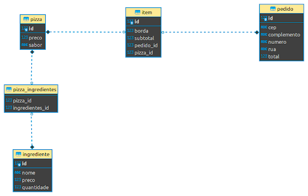

# Pizzaria

A ideia aqui é realizar a resolução de problemas (troubleshooting) e a criação de testes unitários e de integração para
o projeto.

Como guia, deixaremos aqui o diagrama de classes de domínio da aplicação.

## Atividades

Vamos começar com a seguinte ordem das atividades:

1. Fazer o projeto rodar;
2. Criar os testes para cadastro de ingredientes;
3. Criar os testes para cadastro de Pizzas;
4. Criar os testes para o novo pedido.

O projeto tem algumas falhas de lógica e implementação. Com o auxílio dos testes, 
vamos encontrar essas falhas e corrigi-las.

Meta: Ter pelo menos **75%** do projeto coberto por testes.

> Dicas:
> 
> Lembre-se das práticas de testes;
> 
> Podemos mesclar testes de unidade com testes de integração;
> 
> Se atente as fronteiras do seu teste;
> 
> Caminhos felizes e caminhos tristes precisam ser testados.
> 